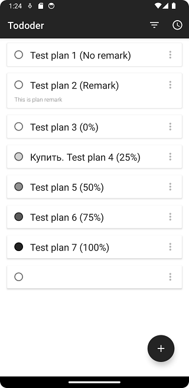
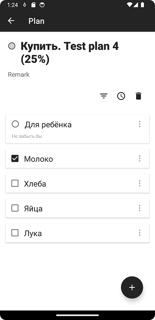
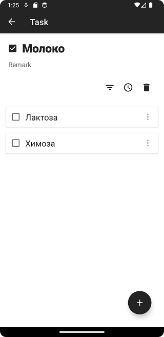

# Todo app
## Фичи
1. Бесконечное дерево планов и тасков
2. Показ прогресса выполнения в планах
3. Сохранение и чтение данных из файлов
4. Сортировка по заголовку и времени создания
5. Разные типы показываемых элементов
6. Оптимизированная подгрузка данных приложения

## Технологии
1. Custom view
2. CardView
3. MVVM
4. ViewBinding
5. Kodein (DI)

